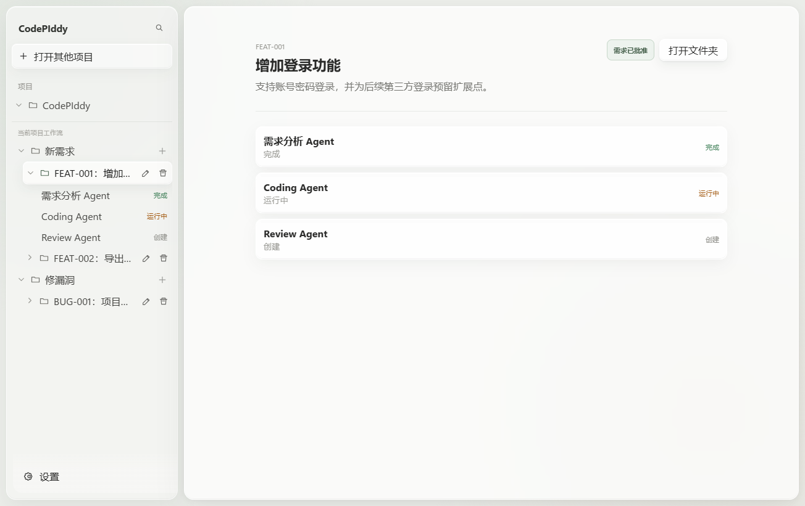
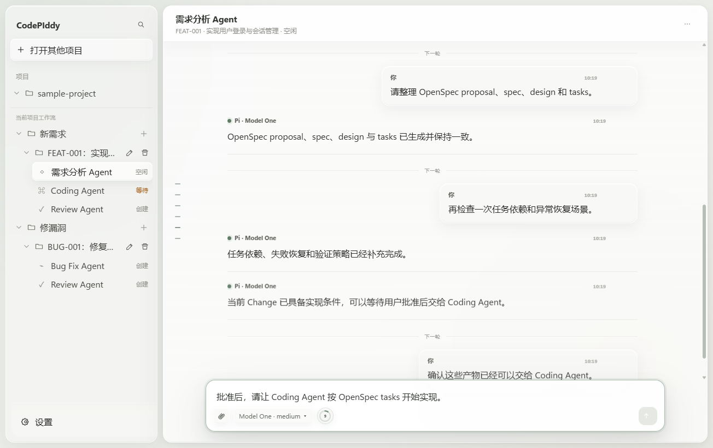
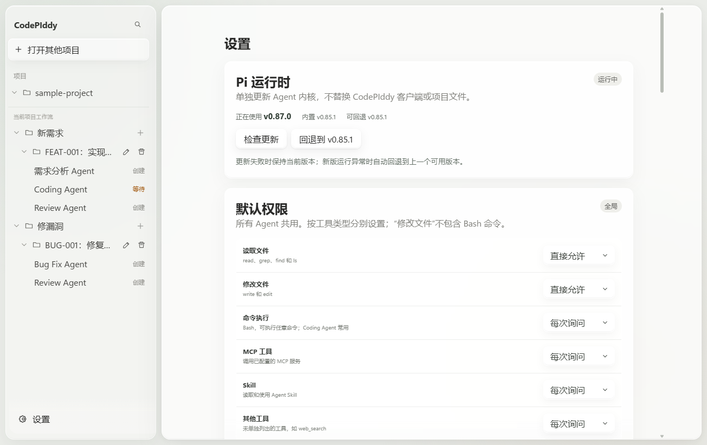

<p align="center">
  
</p>

<h1 align="center">CodePIddy</h1>

<p align="center"><strong>把程序员真实的“做需求”和“修 Bug”工作方式，变成可管理、可交接、可长期使用的 Pi Coding Agent 桌面客户端。</strong></p>

<p align="center">
  
  
  
  
  
</p>

<p align="center">
  <a href="https://github.com/ZhAOYuBo1/My-PI-development-workflow/releases/latest"><strong>下载 Windows 版本</strong></a>
  ·
  <a href="docs/codepiddy/MVP_SPEC.md">查看 MVP 规格</a>
  ·
  <a href="docs/codepiddy/HANDOFF_PROTOCOL.md">查看交接协议</a>
</p>

<p align="center">
  
</p>

## 为什么要做 CodePIddy

很多 Coding Agent 擅长“完成一次对话”，但程序员的真实工作并不是一条全自动流水线。

日常开发通常只有两类工作：

```text
做一个新需求
修一个已经存在的问题
```

这两类工作都需要需求理解、实现、测试、审核和返工，但每一步未必连续发生，也不应该由系统擅自推进。开发者需要随时停下来确认需求、切换模型、补充背景、检查代码，或者回到前一步继续修改。

因此 CodePIddy 的核心不是“更多 Agent”，而是：

1. **两种固定工作方式**：每个项目默认包含“新需求”和“修漏洞”；
2. **职责明确的长期 Agent**：需求分析、Coding、Bug Fix、Review 各自负责不同工作；
3. **文档与代码交接**：Agent 之间不共享短期记忆，而是通过 OpenSpec、Git diff、测试和项目文档协作；
4. **用户掌握推进权**：是否批准需求、何时编码、何时审核、是否返工和归档，都由人决定；
5. **Pi 仍是底层事实源**：模型、Session、Tool、Skill、Slash Command 和 Provider 都来自 Pi，CodePIddy 负责工作流和客户端体验。

> CodePIddy 不是 Pi 的 UI 换皮，也不是自动运行的 Agent 流水线。它是面向程序员日常开发过程的桌面工作台。

## 两条工作流

### 新需求

```text
用户想法
  -> Requirement Analysis Agent
       -> Grill With Docs：逐项澄清需求
       -> OpenSpec：proposal / specs / design / tasks
  -> 用户批准需求
  -> Coding Agent
       -> openspec-apply-change
       -> 代码、测试、任务状态与 Git diff
  -> Review Agent
       -> open-code-review
       -> 测试、Findings 与 Verdict
  -> 用户决定继续修正或归档
```

### 修漏洞

```text
Bug 描述
  -> Bug Fix Agent
       -> OpenSpec：问题、根因、决策与任务
       -> 修复代码并补充测试
  -> Review Agent
       -> OpenSpec + Git diff + open-code-review
  -> 用户决定继续修正或归档
```

CodePIddy 不再要求固定的 `requirement.md`、`implementation.md`、`fix.md` 或 `review.md`。**Grill 和 OpenSpec 产生的真实产物就是交接文档**。

## 客户端界面

<table>
  <tr>
    <td width="50%"></td>
    <td width="50%"></td>
  </tr>
  <tr>
    <td align="center"><strong>长期 Agent 会话、上下文、模型与工具状态</strong></td>
    <td align="center"><strong>Pi 版本管理与全局权限</strong></td>
  </tr>
</table>

以上截图来自隔离的演示项目，不包含真实项目文件、API Key 或私人会话。

界面使用原有中性色调，并通过半透明、背景模糊、内高光和多层阴影增加层次。目标是保持长时间编程时的低干扰，同时让项目、工作项、Agent、权限和运行状态清晰可见。

## 内置 Skill

以下 Skill 随 CodePIddy 一起分发，不要求用户单独下载 Skill 文件：

| Agent | 默认启用 |
| --- | --- |
| Requirement Analysis | `grill-with-docs`、`openspec-explore`、`openspec-propose`、`openspec-update-change` |
| Coding | `openspec-apply-change`、`openspec-sync-specs` |
| Bug Fix | `openspec-explore`、`openspec-propose`、`openspec-apply-change`、`openspec-sync-specs` |
| Review | `open-code-review` |

另外还内置但默认不主动分配：

- `openspec-archive-change`

所有 Skill 都可以在设置中按 Agent 类型启用或停用。项目自己的 Skill 可以放在：

```text
<project>/.codepiddy/.pi/skills
```

设置页面提供“打开项目 Skill 文件夹”入口。

> OpenSpec Skill 调用 `openspec` CLI，Open Code Review Skill 调用 `ocr` CLI。Skill 指令随应用分发；使用对应能力时仍需要相应 CLI 和模型 Provider 可用。

## 更新 Pi 内核

在 **设置 → Pi 运行时** 中检查新版本，确认后从 npm 安装 `@earendil-works/pi-coding-agent`。CodePIddy 先在独立目录校验 RPC、模型列表、命令和内置扩展，再切换到新版；现有 Agent 不会在运行中被强制中断，重启客户端后生效。安装或校验失败时保留原版本；如新版启动失败会自动回退到更新前的版本，也可手动点击“回退到 v…”逐次回退。第一次从内置版本更新后，回退目标才是内置版本；后续更新会把上一次使用的版本作为回退目标。

这只更新 Pi 内核，不更新 CodePIddy UI 或项目文件。Windows 安装包自带更新所需的 npm，无需另装 Node.js；源码开发模式会使用本机 npm。更新前仍应备份重要项目和会话。内置的 Pi 版本可随 CodePIddy 发布升级，独立更新不修改仓库源码。

## 已实现能力

- Windows Electron 桌面客户端；
- 项目、最近项目和窗口状态持久化；
- 新需求 / 修漏洞两条隔离工作流；
- 多 Work Item、归档、恢复、重命名和删除；
- 单 Slot 单长期 Agent Session；
- 用户控制的需求批准门；
- Grill + OpenSpec 动态交接；
- Pi RPC 流式消息、Thinking、Tool Card 和错误恢复；
- 中断、Retry、Compaction、Steering；
- Session Tree、Fork、Clone、Reset、Resume、Import；
- 模型、Thinking Level 和 Scoped Models；
- 图片附件、拖放和剪贴板粘贴；
- 动态 Slash Commands 和 Skill Commands；
- OAuth Provider 登录与退出；
- 默认允许项目内文件读写，并可以在设置中调整；
- 项目级单写入 Lease；
- Tavily Search-only Web Search；
- Pi 进程崩溃检测和自动重连；
- Pi 运行时独立版本检查、校验更新和回退；
- SQLite UI 状态持久化；
- Electron IPC 校验、CSP、Context Isolation 和 Renderer Sandbox；
- Core、Desktop 与 Electron E2E 测试。

## 下载与运行

前往 [GitHub Releases](https://github.com/ZhAOYuBo1/My-PI-development-workflow/releases/latest) 下载 Windows `.exe`。

当前发布目标：

```text
Windows 10 / Windows 11
x64
```

首次运行后，需要在 Pi 原生配置中准备至少一个可用模型或 Provider：

```text
~/.pi/agent/models.json
~/.pi/agent/settings.json
```

也可以在 Agent 中使用 `/login` 完成受支持 Provider 的 OAuth 登录。

> 当前 Release 未进行商业代码签名，Windows 可能显示未知发布者提示。请仅从本仓库 Release 下载。

## 本地开发

### 环境

- Windows 10 或 Windows 11
- Node.js 22.19 或更高版本
- npm

### 从 GitHub 克隆并启动

```powershell
git clone https://github.com/ZhAOYuBo1/My-PI-development-workflow.git
cd My-PI-development-workflow
npm ci --ignore-scripts
npm run install:electron
npm run build:codepiddy
npm start --workspace=@codepiddy/desktop
```

说明：

1. `npm ci --ignore-scripts` 按锁文件安装依赖，同时避免自动执行第三方安装脚本；
2. `npm run install:electron` 显式下载 Electron 运行文件，首次开发必须执行；
3. `npm run build:codepiddy` 构建共享类型、核心服务、Tavily MCP 和桌面客户端；
4. `npm start --workspace=@codepiddy/desktop` 启动 CodePIddy。

`npm run install:electron` 会优先使用 Electron 官方下载地址；如果下载失败且没有手动配置 `ELECTRON_MIRROR`，会自动改用 npmmirror 镜像重试。

后续日常开发通常只需重新构建并启动：

```powershell
npm run build:codepiddy
npm start --workspace=@codepiddy/desktop
```

### 验证

```powershell
npm run check
npm test --workspace=@codepiddy/core
npm test --workspace=@codepiddy/desktop
npm run test:e2e --workspace=@codepiddy/desktop
```

### 构建 Windows Release

```powershell
npm run prepare:codepiddy-package
npm run package:win --workspace=@codepiddy/desktop
```

构建产物位于：

```text
.artifacts/release
```

## 目录结构

```text
packages/codepiddy-desktop/              Electron Main、Preload 与 React Renderer
packages/codepiddy-core/                 Work Item、Agent Registry、Pi RPC 与写锁
packages/codepiddy-shared/               共享 IPC 与工作流类型
packages/codepiddy-agent-skills/         随应用分发的固定 Skill
packages/codepiddy-permission-extension/ 权限系统适配
packages/codepiddy-tavily-search-mcp/    Tavily Search MCP
packages/codepiddy-tavily-tool-extension Pi Search Tool 包装
packages/coding-agent/                   Pi Coding Agent Runtime
docs/codepiddy/                          产品决策、架构与工作流文档
```

## 安全说明

- Renderer 开启 Sandbox 与 Context Isolation；
- 禁用 Renderer Node Integration；
- IPC 输入进行运行时校验；
- Tavily Key 使用 Electron `safeStorage`；
- 默认只直接允许项目内文件读取和修改；
- Bash、MCP、Skill 和项目外路径仍可以配置审批策略；
- 当前 Windows MVP 尚未提供强执行沙箱，Agent 进程仍使用当前操作系统用户权限。

更多信息见 [SECURITY.md](SECURITY.md)。

## 开源与贡献

CodePIddy 是一个开源项目，目前仍在持续完善。

欢迎大家：

- 提交 Issue，反馈真实开发过程中的问题；
- 补充新的 Agent 工作方式和 Skill；
- 改进 OpenSpec、Review、权限和交接体验；
- 修复 Bug、补充测试和文档；
- 提交 Pull Request；
- 分享不同模型、Provider 和项目类型下的使用经验。

如果你认可“**Agent 各司其职、通过真实产物交接、流程由人控制**”这个方向，欢迎一起完善 CodePIddy。

## 上游 Pi

CodePIddy 基于开源 Pi Agent Harness 开发。Pi 继续负责模型、Provider、Session、Tool、Skill 与 Slash Command；CodePIddy 提供桌面客户端、项目管理和工作流层。

- 上游说明：[docs/upstream/PI_README.md](docs/upstream/PI_README.md)

## License

本仓库保留上游 MIT License，详见 [LICENSE](LICENSE)。Bundled Skills 保留各自文件中声明的许可证和作者信息。
